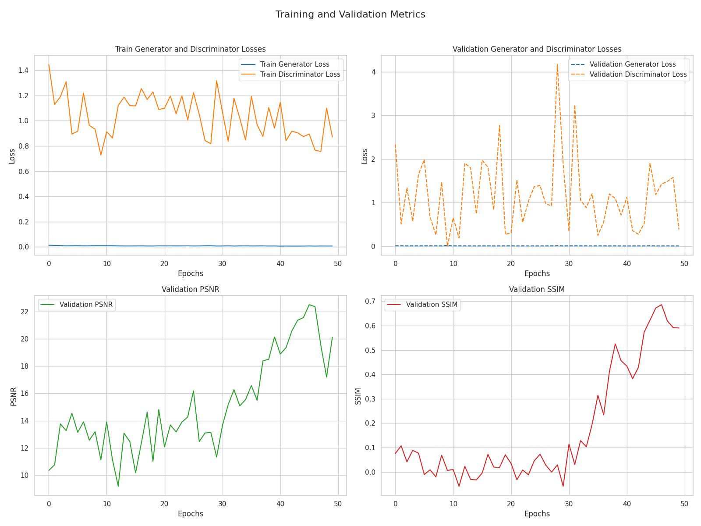
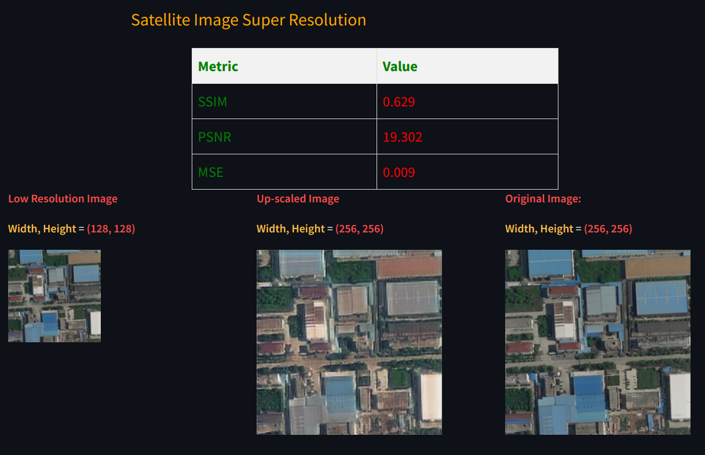

### Satellite Image Super Resolution:

**2X images resolution using SRGAN architecture.**

#### Project setup 

Step 1: Install the requirements:
```
python -r requirements.txt
```

Step 2: Download data 
```
python src/data_downloader.py 
```

Step 3: Run the Training
```
python main.py
``` 

Step 4: Run the ui file. 
```
streamlit run ui.py
```

The repo contains pre-trained model that is trained up to 50 epochs inside the `output` directory. The model in 2 X NVIDIA T4 Tensor Core GPU. 

Here are the metrics and loss after 50 epochs. 



#### Demo UI 



### Dataset Used
- https://github.com/Junjue-Wang/EarthVQA
- Google Drive Directory: https://drive.google.com/drive/folders/1WPgrVtZeNe2Cq0QZPsSrh0iV5b55TrZY
- Citation [LINK](https://drive.google.com/drive/folders/1WPgrVtZeNe2Cq0QZPsSrh0iV5b55TrZY)


